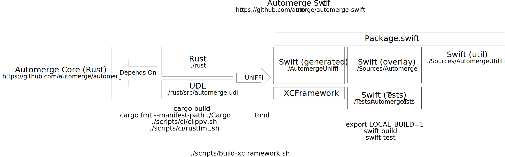

# Project layers for Automerge-swift

The Automerge package intentionally holds no additional package dependencies, aside from the core Automerge library.
In Automerge, conditionally compile for platform specific dependencies (for example, `Combine`, `SwiftUI`, `CoreTransferrable`, `UniformTypeIdentifiers`) so that the package compiles cleanly in WASM.
This is "enforced" by a validation build that compiles the project using a Swift-WASM toolchain.

